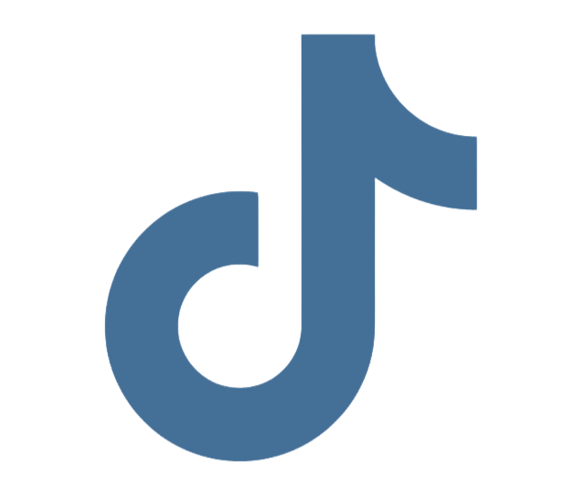

# PydyTuesday: A Posit collaboration with TidyTuesday 🎉 

### Resources for participating in TidyTuesday using Python

If you **didn't** get here via [the official TidyTuesday github repo](https://github.com/rfordatascience/tidytuesday?tab=readme-ov-file#datasets), we encourage you to go check it out first. It's a weekly data science challenge run by the [Data Science Learning Community](https://dslc.io/), with a new data set added each week. 

This repository is a place to find resources that will help you explore the TidyTuesday experience in Python. Inside the readme file of each week's TidyTuesday data set, you'll see our invitation: can you create something in python that explore this week's data? It could be a quick plot, or a model, or you could use this opportunity to test out a new package. Could you create a Quarto dashboard that communicates insights about this week's data set?  

To participate, share your efforts, big or small, to your community of choice, and don't forget to tag us using the hashtags **#TidyTuesday** and **#PydyTuesday** so that we can highlight your work!

### Here's where you can tag us when you share your submissions!

&nbsp;
&nbsp;
&nbsp;

**We love the data community.** We can't wait for you to share your work with the most brilliant and supportive community out there, and we want to support you in your journey, too. Here are some resources to get you going!  

[Welcome to PydyTuesday! | How to Level Up your Python Skills](https://youtu.be/gCSkxt4omKo](https://www.youtube.com/watch?v=kRfYVtwg4dE&list=PL9HYL-VRX0oTWuJfkuIeaqXgxcoJWJGSC&index=1)) 

[Let's set up your Python environment with only 2 steps | PydyTuesday Python Projects](https://www.youtube.com/watch?v=9i7rCSL5EVM&list=PL9HYL-VRX0oTWuJfkuIeaqXgxcoJWJGSC&index=2)

[Let's install your first Python library in 2 minutes](https://www.youtube.com/watch?v=WkKWsrf_2TI&list=PL9HYL-VRX0oTWuJfkuIeaqXgxcoJWJGSC&index=3)

[Let's Import Free, High-Quality Datasets into your Python IDE (using Positron and PydyTuesday)](https://www.youtube.com/watch?v=QkUC-Ok3sMA&list=PL9HYL-VRX0oTWuJfkuIeaqXgxcoJWJGSC&index=4)

[Create a simple dashboard with Python + Quarto](https://youtu.be/uLGe9zuuNl0?feature=shared)  

[Deploy your work to Posit Connect Cloud](https://youtu.be/WD693FBfVUk?si=XkgnfXksqmBRc2OW)

