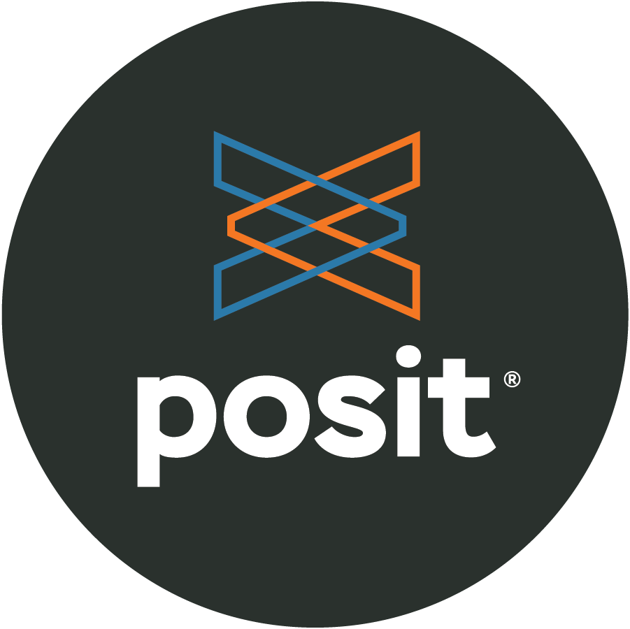
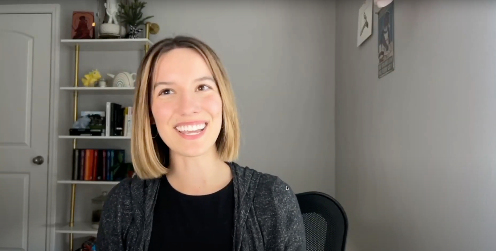

# Python Challenge in collaboration with TidyTuesday 🎉 

### An extra TidyTuesday challenge  

If you **didn't** get here via [the official TidyTuesday github repo](https://github.com/rfordatascience/tidytuesday), we encourage you to go check it out first. It's a weekly data science challenge run by the [Data Science Learning Community](https://dslc.io/), with a new data set added each week. 

This repository is your destination for an added challenge. Inside the readme file of each week's TidyTuesday data set, you'll see our challenge: can you create a Quarto dashboard that communicates insights about this week's data set? To participate, share your result to your community of choice, and don't forget to tag us using the hastags #TidyTuesday and #PositPythonChallenge so that we can highlight your work!

### Here's where you can tag us when you share your submissions!
&nbsp;
&nbsp;
&nbsp;
&nbsp;

**We love the data community.** We can't wait for you to share your work with the most brilliant and supportive community out there, and we want to support you in your journey, too. Here are some resources to get you going!  

[Intro to TidyTuesday + Posit's Python Challenge](https://youtu.be/gCSkxt4omKo?feature=shared)  

[Creating a simpe dashboard with Python + Quarto](https://youtu.be/uLGe9zuuNl0?feature=shared)  

<!--a href="https://www.youtube.com/watch?v=gCSkxt4omKo"></a-->
<!--a href="https://www.youtube.com/watch?v=gCSkxt4omKo"></a-->
<!--a href="https://www.youtube.com/watch?v=uLGe9zuuNl0"></a--> 
